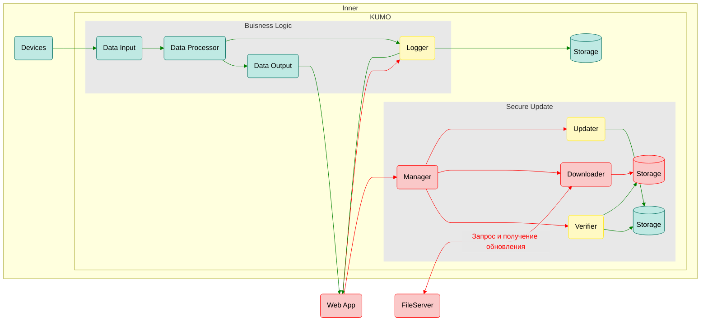

# Кибериммунное устройство мониторинга оборудования

## Содержание 
- [Концепция безопасности продукта](#концепция-безопасности-продукта-)
  - [Назначение документа](#назначение-документа-)
  - [Краткое описание назначения и применения продукта](#краткое-описание-назначения-и-применения-продукта-)
  - [Ценности продукта](#ценности-продукта-)
  - [Неприемлемые события или сценарии в отношении ценностей продукта](#неприемлемые-события-или-сценарии-в-отношении-ценностей-продукта-)
  - [Верхнеуровневые сценарии работы продукта](#верхнеуровневые-сценарии-работы-продукта-)
  - [Роли пользователей](#роли-пользователей-)
  - [Контекст работы системы](#контекст-работы-системы-)
- [Цели и предположения безопасности](#цели-и-предположения-безопасности-)
  - [Цели](#цели-)
  - [Предположения](#предположения-)
- [Сценарии использования](#сценарии-использования-)
- [Негативные сценарии использования](#негативные-сценарии-использования-)
- [Архитектура](#архитектура-)
## Концепция безопасности продукта 
### Назначение документа 
Этот документ пишется бизнес-заказчиком и должен описывать именно бизнес-потребности для различных типов пользователей (ролей) и верхнеуровневые ограничения, которые не являются частью решения. Текст документа должен быть написан простым понятным языком и не содержать сложных терминов и технических подробностей, если они не являются критически важными для дальнейшей проработки решения.

Этот документ используется как отправная точка для более глубокой технической проработки аналитиком и архитектором для формулировки целей и предположений безопасности, негативных сценариев.

### Краткое описание назначения и применения продукта 
Мониторинг микроклимата (автоматизированное непрерывное измерение и журналирование значений температуры, влажности и давления) в помещениях фармацевтического производства. Оповещение пользователей КУМО в случае возникновения аварийного события. Аварийным событием считается выход измеренных значений за пределы допустимого диапазона.

### Ценности продукта 
Оповещение пользователей об аварийных событиях.

### Неприемлемые события или сценарии в отношении ценностей продукта 
* Отсутствие или задержка оповещения (более чем на N минут) при возникновении аварийного события.
* Потеря или подмена результатов измерений внутри КУМО, в результате которых может быть пропущено аварийное событие.

### Верхнеуровневые сценарии работы продукта 
* КУМО с определенной периодичностью получает (LAN/Wi-fi/4G) от оборудования показатели микроклимата: температуру, влажность и давление.
* КУМО анализирует полученные значения на их нахождение внутри допустимого диапазона.
* В случае выхода измеренных значений за допустимые пределы, КУМО незамедлительно рассылает оповещения (уведомление в веб-приложении, смс) заинтересованным пользователям.
* КУМО журналирует полученные значения измерений и сохраняет их в хранилище.
* КУМО получает обновления с сервера производителя.

### Роли пользователей 
* Администратор КУМО.
* Пользователь КУМО.

### Контекст работы системы 
КУМО, измерительное оборудование и хранилище измеренных значений физически находятся внутри охраняемого периметра и взаимодействуют между собой по внутренней сети. Веб-приложение взаимодействует с КУМО из внешней сети.

## Цели и предположения безопасности 
### Цели 

1. Обеспечить безопасное обновление КУМО (в том числе через недоверенные каналы связи).
2. Обеспечить корректную обработку результатов измерений и их передачу в доверенное хранилище безопасным образом.
3. Обеспечить возможность безопасного администрирования системы из внешней сети.
4. Обеспечить однонаправленную передачу данных от приложений, взаимодействующих с внутренней сетью, с приложениями, взаимодействующими с внешней сетью, без возможности воздействия на внутренние ресурсы со стороны внешней сети.

### Предположения 

1. КУМО работает в окружении, гарантирующем отсутствие физического доступа со стороны злоумышленника, в том числе для подключения напрямую к устройству.
2. КУМО имеет отдельные порты для подключения к внутренней и внешней сетям.
3. Низкий уровень угроз со стороны внутренней сети.
4. Все авторизованные пользователи КУМО благонадежны.
5. Физическая надежность и доступность доверенного хранилища не является целью безопасности КУМО.

## Сценарии использования 
1. Обычный пользователь авторизуется в веб-приложении, после чего имеет возможность получать оповещения об аварийных событиях и просматривать журналы.
2. Администратор авторизуется в веб-приложении, после чего имеет возможность получать оповещения об аварийных событиях, просматривать и редактировать журналы, изменять параметры системы.

## Негативные сценарии использования 
1. Злоумышленник подменяет обновление на поврежденное, чтобы исполнить вредоносный код на КУМО.
2. Злоумышленник пытается подобрать пароль к аккаунту Администратора.
3. Злоумышленник получает доступ во внутреннюю сеть (не через КУМО) и проводит атаку на КУМО из внутренней сети.

## Архитектура 

